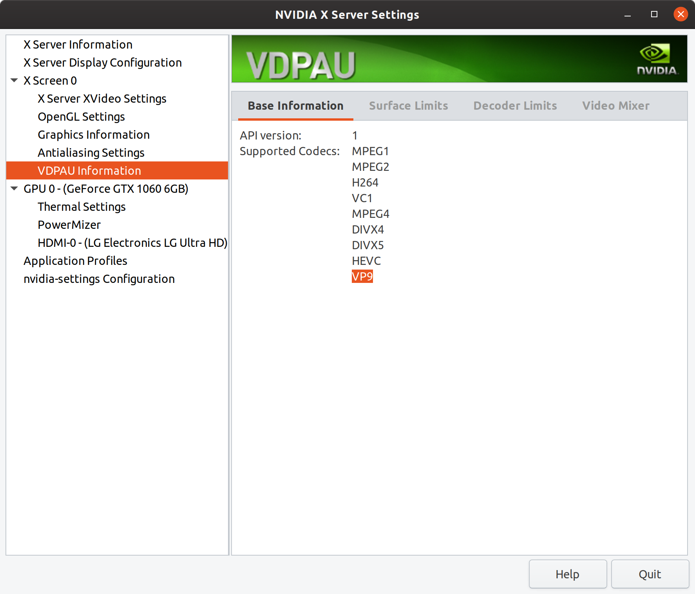
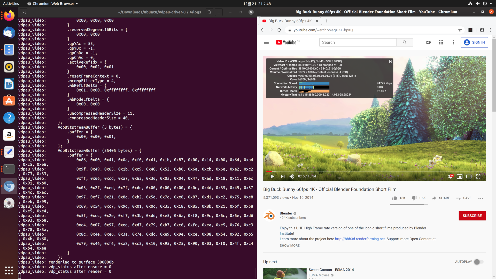

# vdpau-va-driver-vp9
Experimental VP9 codec support for vdpau-va-driver (NVIDIA VDPAU-VAAPI wrapper) and chromium-vaapi. This has only been tested on Ubuntu 19.10 (Linux), so I'm really not sure if it works on anything else but "may". In my experience the patchsets vary per distro and some just didn't work at all on my Ubuntu, so keep this in mind when trying the patch. However, my modifications themselves should not be distro-specific.

Forked off Ubuntu vdpau-va-driver (which includes some patches over the original freedesktop code):
https://launchpad.net/~saiarcot895/+archive/ubuntu/chromium-beta/+sourcepub/10036592/+listing-archive-extra

C associative map taken from (and modified to use integer keys) [sorry, the modifications are really makeshift]:
https://github.com/rxi/map

# Notes

This adds experimental NVIDIA hardware video acceleration support to vdpau-va-driver for videos encoded using VP9 Profile 0 8-bit color depth. This seems to include most of the latest and greatest 4k and 8k videos I've used on YouTube that are hardest on the CPU, also available at lower resolutions in the same codec. As of writing, VP9 Profile 1-3 are not supported in the NVIDIA VDPAU library itself, so support for those cannot be added here either. VP8 also is not supported.

To check whether your GPU can decode VP9, please check the NVDEC support matrix. I believe that this should match the VDPAU capabilities.

https://developer.nvidia.com/video-encode-decode-gpu-support-matrix

Note that 8k currently may not work properly, but 4k and below should work fine. This is based on my testing with a GTX 1060. 8k seems to allocate too many surfaces and run out of resources. I'm currently investigating if there's any way to remedy that, but will likely require modifications to chromium-vaapi.

# Original author of vdpau-va-driver

https://github.com/freedesktop/vdpau-driver

  libva-vdpau-driver
  A VDPAU-based backend for VA-API

  Copyright (C) 2009-2011 Splitted-Desktop Systems

# Requirements

I recommend following this guide. https://www.linuxuprising.com/2018/08/how-to-enable-hardware-accelerated.html
That's how I started. It includes information on everything you need, except this driver. Following the guide completely up to step 3 and then installing this driver will be enough if you're not sure what to do. If you know what you're doing, then you should skip installing vdpau-va-driver from that guide. Also, don't install h264ify if you're planning on using VP9.

1. GPU with VP9 NVDEC decode support: https://developer.nvidia.com/video-encode-decode-gpu-support-matrix
2. NVIDIA Linux video driver (only tested with 440.44 so far; not sure what the minimum version is for VP9 support)

   nvidia-settings should show "VP9" under X Screen/VDPAU Information/Base Information
   

3. Chromium with VAAPI patch (NOT Google Chrome)
4. VDPAU latest include headers (for compiling this patch): https://gitlab.freedesktop.org/ManojBonda/libvdpau

# Limitations and Disclaimers

Don't expect a lot. This may crash, hang, just not work at all, or result in video artifacts. This is extremely experimental, and roughly half of the VP9 codec probably isn't even implemented at all. That's denoted by 'XXX' comments in the code. (It seems that the other codecs implemented in the wrapper may also be missing some features.)

That being said, based on my testing I haven't found significant video artifacts or all-out crashes yet. It appears that most videos may not use the features that aren't implemented or maybe they just don't make enough of a difference visually, or I just haven't noticed yet; I'm really not sure, but I'm just providing this in good faith because it "seems to work". I would appreciate bug reports, contributions, etc. though and will try to look at them when I have time.

# Future Work

1. Getting this patch to work well enough
2. Getting 8k video HW accel to work, because it seems to work on Windows
3. Most likely out of the scope of VDPAU, but for hardware acceleration on Linux/web browsers in general: VP9 Profiles 1-3, AV1, HEVC H.265, more native support for VDPAU/Cuvid/NVDEC/NVENC in Chromium, Firefox, etc, etc...
4. Stretch goal: achieving HW accel feature parity with Windows on Chromium or Firefox on Linux distributions officially

# Compiling

Don't forget to use the latest VDPAU headers with VP9 support. There may be other dependencies depending on your distro.

    $ git clone https://github.com/xtknight/vdpau-va-driver-vp9.git
    $ cd vdpau-va-driver-vp9
    $ ./autogen.sh --prefix=/usr
    $ make
    $ sudo make install

# Using

Launch chromium-vaapi without using extensions like h264ify and try some 4k videos. It works with lower resolutions too but many CPUs are already fast enough to decode 1080p so it would be hard to notice. It may also work with 8k depending on your card and/or setup.

Right click the YouTube video and click 'Stats for Nerds' to ensure codec starts with vp09.00. (VP9 profile 0). Here's an example 4k@60fps video in VP9 (as of writing): https://www.youtube.com/watch?v=aqz-KE-bpKQ

Depending on how fast your CPU is, it may actually hard to *prove* that the GPU is being used. Although those with slower CPUs will probably notice a lot easier. There's still going to be some CPU usage, so don't be surprised. Exactly why, I'm not sure, but may be related to issues in the frame handling that can be optimized. And I need to do more testing to see how much of a problem that really is. Based on nvidia-smi, my GTX 1060 seems to be around 25-40% usage for 4k@60fps if the video is playing and only around 15% if the video is paused. For me CPU usage is reduced from around ~450% (multi-core) to around ~50-100% if I disable HW accel in Chromium through the flags. It's a big improvement, at least, the difference between potentially being able to play a video smoothly without dropped frames and not being able to do so.

# Debugging

## vdpau-va-driver
Verbose debug messages
```
export VDPAU_VIDEO_DEBUG=1
```

More detailed trace messages that output data structures
```
export VDPAU_VIDEO_TRACE=1
```

## NVIDIA VDPAU
Trace all function calls made to VDPAU library and dump most parameters

https://download.nvidia.com/XFree86/Linux-x86_64/440.44/README/vdpausupport.html

VDPAU_TRACE: Enables tracing. Set to 1 to trace function calls. Set to 2 to trace all arguments passed to the function.
VDPAU_TRACE_FILE: Filename to write traces to. By default, traces are sent to stderr. This variable may either contain a plain filename, or a reference to an existing open file-descriptor in the format "&N" where N is the file descriptor number.

```
export VDPAU_TRACE=2
export VDPAU_NVIDIA_DEBUG=3
export VDPAU_TRACE_FILE=chromium-vdpau.log
```

# Screenshots


